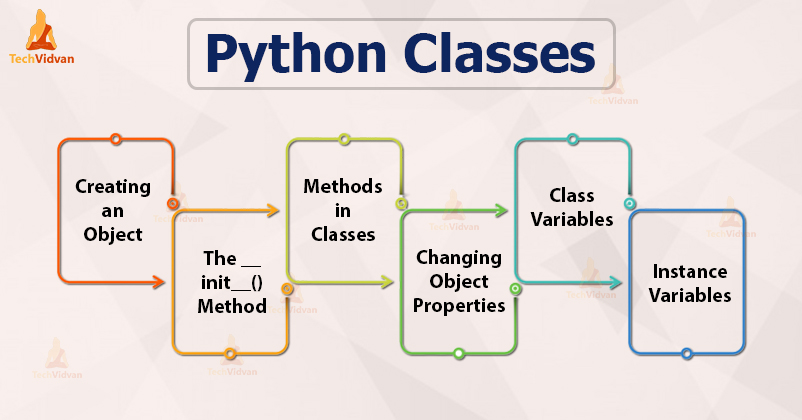
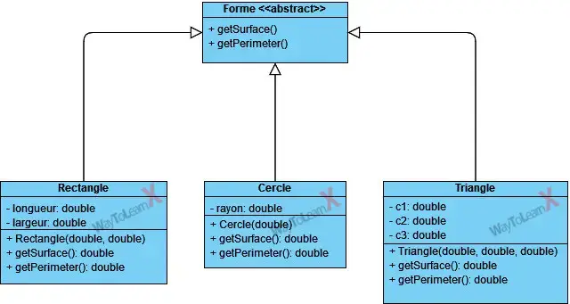
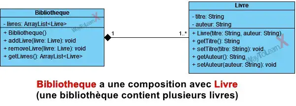
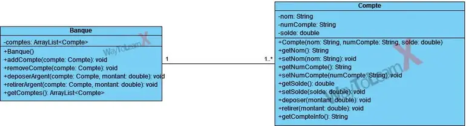

# Python - POO

# 0. Pré-requis : git !
Tuto git/github: **https://www.youtube.com/watch?v=OpgmGI49Uxg**
Git en 5min: https://www.youtube.com/watch?v=gGKZLfPYORs
* Installer git :
Windows : utiliser git bash
https://git-scm.com/downloads/win
* Cloner le repo:  https://github.com/yzpt/module_python_poo.git sur votre machine
* Créer un compte github !

# 0.1. Top voices à suivre pour faire sa veille technologique (data):
- Florent Jakubowski : https://www.linkedin.com/in/florent-j-93716410b/
- Gael Penessot : https://www.linkedin.com/in/gael-penessot/
- Attention aux charlatans ! (Benjamin Dubreu, Morgan Gautherot, etc.)

# 1. Sélection de ressources

### Vidéos
* 🇫🇷 Code avec Jonathan | https://www.youtube.com/watch?v=Y-wXK0Wu5pc
* 🇫🇷 Docstring : Python : La programmation orientée objet | https://www.youtube.com/watch?v=h6jciR8K43E
* 🇬🇧 FreeCodeCamp: Object Oriented Programming with Python - Full Course for Beginners | https://www.youtube.com/watch?v=Ej_02ICOIgs 

### Sélection de PDF
* [Python - POO - Cours Anis Saied](cours/cours_python_poo_anis_saied.pdf)
* Chapitres 23 & 24 du [cours_python_univ_paris_cite.pdf](cours/cours_python_univ_paris_cite.pdf)
* [Cours python - POO - OFPPT](cours/cours_python_poo_ofppt.pdf)
* Chapitre 7 du [cours_python_cordeau_pointal.pdf](cours/cours_python_cordeau_pointal.pdf)
* [Cours Python - POO - Zeste de Savoir](cours/cours_python_poo_zeste_de_savoir.pdf)
* [Cours Python - POO - Cédric Buche Université de Brest](cours/cours_python_poo_buche_univ_brest.pdf)
* NSI Saint-Aspais Terminale (https://mcoilhac.forge.apps.education.fr/term/POO/1_cours_POO/)

# 2. Exercices

### Exercice 1:
Écrire une classe nommée Rectangle dont le constructeur prend deux paramètres (largeur, longueur) et les fonctions suivantes:
- Calcul du périmètre
- Calcul de la surface
- Afficher le rectangle sous la forme "Rectangle de largeur L et longueur l"
- Les accesseurs et mutateurs triviaux (lecture et modification du paramètres largeur et longueur).

### Exercice 2:
Écrivez un programme Python pour créer une classe Personne. Incluez des attributs tels que le nom, le pays et la date de naissance. Implémentez une méthode pour déterminer l’âge de la personne.

### Exercice 3:
Créez d'abord la classe Article !
Écrivez un programme Python pour créer une classe représentant un panier d'achat. Incluez des méthodes pour ajouter et supprimer des articles, et pour calculer le prix total.
Il faudra aussi créer une classe Article qui contiendra le nom de l’article, le prix unitaire et la quantité. Implémentez les méthodes nécessaires pour gérer les articles dans le panier.

### Exercice 4:
Écrire un programme Python pour créer une classe "carte" qui représente une carte à jouer. La classe doit avoir des attributs pour la couleur, la valeur et le symbole de la carte. Implémentez une méthode pour afficher les détails de la carte.
Créez également une classe "paquet" qui représente un paquet de cartes. La classe doit avoir des méthodes pour ajouter et retirer des cartes, ainsi que pour mélanger le paquet.

### Exercice 5:
Écrivez un programme Python pour créer une classe appelée 'Forme' avec des méthodes abstraites pour calculer la surface et le périmètre, et des sous-classes pour le 'Rectangle', le 'Cercle' et le 'Triangle'.

### Exercice 6:
Écrire un programme Python pour créer une classe appelée « Bibliotheque » avec une collection de livres et des méthodes pour ajouter et supprimer des livres.

### Exercice 7:
Écrivez un programme Python pour créer une classe appelée « Banque » avec une collection de comptes et des méthodes pour ajouter et supprimer des comptes, et pour déposer et retirer de l’argent. Définissez également une classe appelée « Compte » pour gérer les détails du compte d’un client particulier.

# 3. Applications console:

Prenez connaissance et executez le script app_0_template.py, c'est une base pour vos applications console.

Complétez les applications :

### app_1_bibliotheque.py 
- déjà complète

### app_2_comptes.py 

### app_3_cartes.py

### app_4_panier.py

  

# 4. Heritage et polymorphisme

[heritage_animaux.py](heritage_animaux.py)
[heritage_personnes.py](heritage_personnes.py)
[heritage_geometrie.py](heritage_geometrie.py)

# 5. Attributs et méthodes publics, protégés et privés

[visibilitebiblio.py](visibilitebiblio.py)
[visibilite_comptes.py](visibilite_comptes.py)
[visibilite_stock.py](visibilite_stock.py)

# 6. Projet : gestion de chambres d'hôtel

Créer une application de gestion de chambres d'hôtel. L'application doit permettre de gérer les réservations, les clients et les chambres.
Elle comportera au minimum les classes suivantes :
- Client (id, nom, prénom)
- Chambre (id, prix)
- Réservation (id, date d'arrivée, date de départ, client, chambre)

Le menu principal de l'application doit permettre -au minimum- de :
- Ajouter un client
- Faire une réservation
- Afficher les réservations
- Afficher les clients
- Afficher les chambres
- Quitter l'application
  
Spécifications :
- Un client doit avoir un nom, un prénom, une adresse et un numéro de téléphone.
- Une chambre doit avoir un numéro, un type (simple, double, suite) et un prix.

### 1er niveau : sans héritage, on réfère le client et la chmabre de la réservation par l'id du client et l'id de la chambre.

Client:
  - id : int
  - nom: str
  - prenom: str
  
Chambre:
  - id: int
  - numéro: int
  - prix: float
  - type: str

Reservation:
  - id: int
  - date_arrivee: str
  - date_depart: str
  - client_id: int
  - chambre_id: int

La classe Hotel gère les données :

class Hotel:
    def __init__(self):
        self.clients = []
        self.chambres = []
        self.reservations = []

    # Clients
    def ajouter_client(self, client):
        ...

    def lister_clients(self):
        ...

    # Chambres
    def ajouter_chambre(self, chambre):
        ...

    def lister_chambres(self):
        ...

    # Réservations
    def ajouter_reservation(self, reservation: Reservation):
        ...

    def lister_reservations(self):
        ..

### 2ème niveau : avec héritage, on créé des classes ChambreSimple, ChambreDouble, ChambreSuite qui héritent de la classe Chambre.

